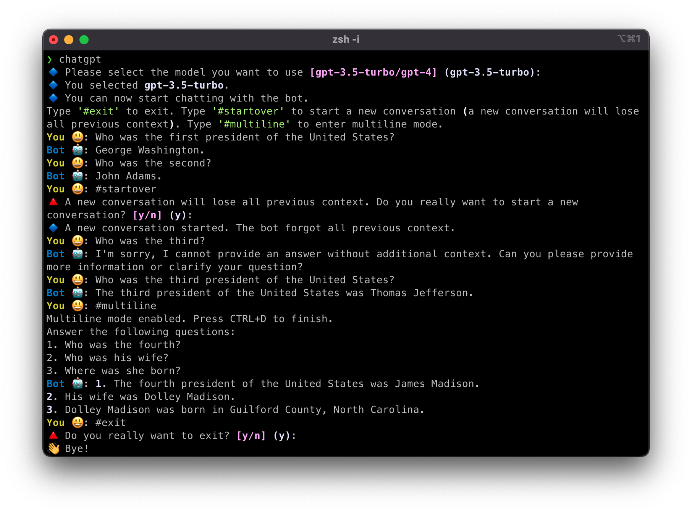

# Simple-ChatGPT-CLI

A simple implementation of ChatGPT in terminal, so I can avoid using the ChatGPT website which is more expensive and less privacy-friendly.

## Installation

```bash
pip install simple-chatgpt-cli
```

## Usage

You can run the program with
```bash
chatgpt
```

You must either have environment variable `OPENAI_API_KEY` or set the key following the CLI prompts.



## Tips

Use `#startover` to start a new conversation whenever you switch to a new topic and the bot doesn't need previous context anymore. This helps reduce your OpenAI bill.

The program will remind you this if you come back to an idle conversation after more than 5 minutes.

## Development

This project was initialized by my [Python project boilerplate](https://github.com/tailaiw/python-boilerplate). So you will need all the prerequisites of that project.
